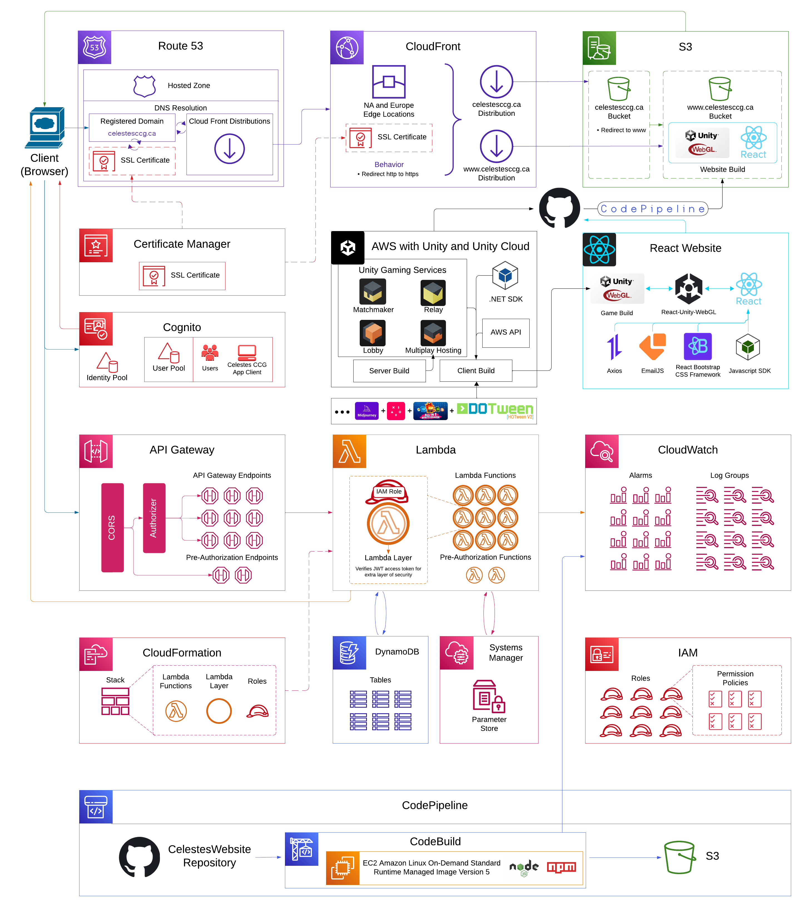

# Celestes CCG - WebGL Game & AWS Integration

## 🌟 Overview  
**Celestes CCG** is a fantasy-world **turn-based strategy card game** featuring **100+ unique cards**, each with special skills and mechanics. Players compete in a ranking system for **weekly rewards**, strategizing their decks to dominate opponents.  

This repository contains the **WebGL game build** and the **React-based website** that integrates with AWS cloud services for **scalability, security, and performance**.  

## 🚀 Key Features  

### 🔹 WebGL Game Hosting  
- Hosted on **Amazon S3** with **CloudFront** for optimized global content delivery.  
- Custom domain & SSL security managed via **Route 53** and **Certificate Manager**.  

### 🔹 Authentication & User Management  
- **AWS Cognito** handles identity pools, user authentication, and API security.  

### 🔹 Game Backend Services  
- **Unity Gaming Services** for matchmaking, relay, lobby, and multiplayer hosting.  
- Backend powered by **AWS Unity SDK** and **API Gateway + Lambda Functions**.  

### 🔹 Data Storage & Configuration  
- **DynamoDB** stores game data.  
- **AWS Systems Manager** manages configuration and secrets.  

### 🔹 Monitoring & Logging  
- **AWS CloudWatch** tracks performance, logs errors, and sets up alarms.  

### 🔹 CI/CD Pipeline  
- **AWS CodePipeline & CodeBuild** automate deployment from the **CelestesWebsite Repository** to **S3**.  

### 🔹 React Frontend  
- Built using **React-Unity-WebGL**.  
- Uses modern frameworks like **Bootstrap, Axios, and EmailJS** for an interactive experience.  

> 📖 **Read more about the creation of this project:**  
> [How I Used AWS and Amazon Q to Build Celestes CCG](https://community.aws/content/2q6EsAajxIGYTmcpQgvesusJwEs/how-i-used-aws-and-amazon-q-to-build-celestes-ccg)  

> 🎥 **Watch the game demo on YouTube:**  
> [Celestes CCG - Game Demo](https://www.youtube.com/watch?v=cL0chb_wsfI)

Archiutecture Diagram:

---
